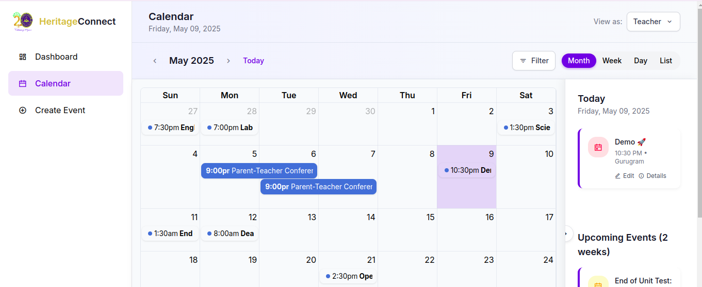
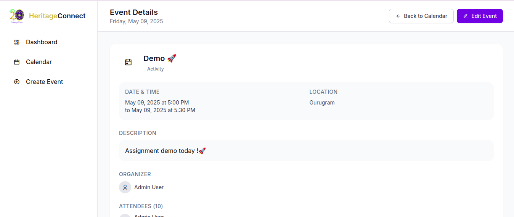
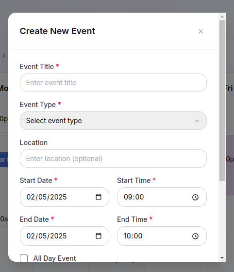
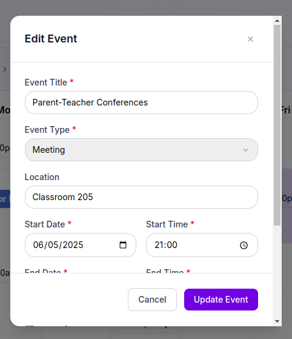
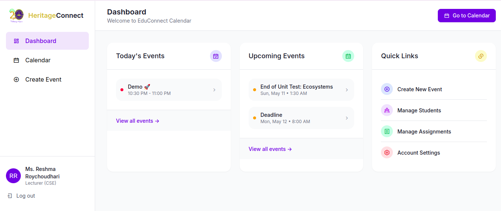
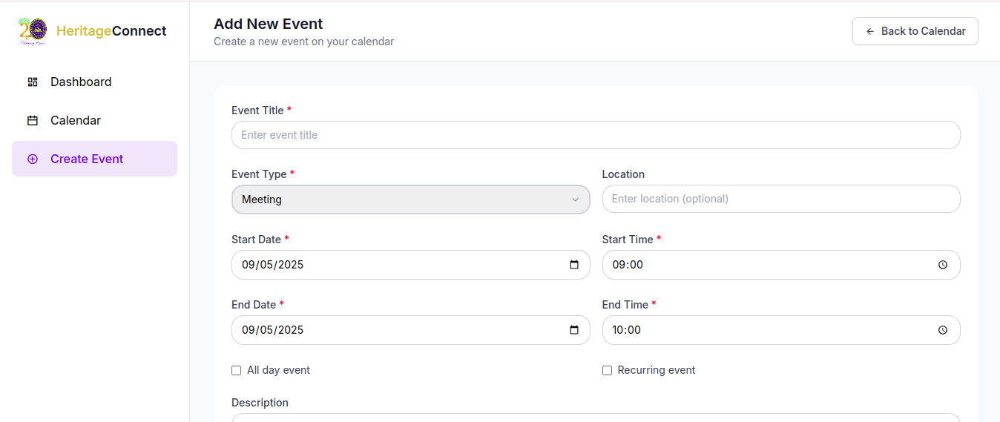

# HeritageConnect Calendar Application

A beautiful, responsive calendar application for educational institutions that allows teachers, students, administrators, and parents to manage and view events.

## Tech Stack

-   **Backend**: PHP 8.1+ with Laravel 10
-   **Frontend**:
    -   HTML5, CSS3, JavaScript (ES6+)
    -   TailwindCSS for styling
    -   FullCalendar.js for the interactive calendar
    -   Moment.js for date handling
-   **Database**: MySQL 8.0+
-   **Additional Libraries**:
    -   Toastr.js for notifications
    -   Remixicon for icons

## Features

-   📅 Interactive calendar with month, week, day, and list views
-   📊 Responsive design that works on desktop and mobile devices
-   📝 Create, edit, and delete events with detailed information
-   👥 Role-based views (Teacher, Student, Administrator, Parent)
-   🏷️ Event categorization with color coding
-   📋 Event filtering by type
-   📱 Collapsible sidebar for optimal space usage
-   🔔 Today's events and upcoming events display
-   🔄 Smooth animations and transitions

## Screenshots

### Main Calendar View



### Event Details



### Create New Event



### Edit Event



### Dashboard



### Add New Event Form



## Installation

### Prerequisites

-   PHP 8.1 or higher
-   Composer
-   MySQL 8.0 or higher
-   Node.js and NPM

### Setup Instructions

1. **Clone the repository**

    ```bash
    git clone https://github.com/your-username/heritage-connect.git
    cd heritage-connect
    ```

2. **Install PHP dependencies**

    ```bash
    composer install
    ```

3. **Install JavaScript dependencies**

    ```bash
    npm install
    ```

4. **Build assets**

    ```bash
    npm run dev
    ```

5. **Environment setup**

    ```bash
    cp .env.example .env
    php artisan key:generate
    ```

6. **Configure the database**

    Edit `.env` file and set database credentials:

    ```
    DB_CONNECTION=mysql
    DB_HOST=127.0.0.1
    DB_PORT=3306
    DB_DATABASE=heritage_connect
    DB_USERNAME=root
    DB_PASSWORD=
    ```

7. **Run migrations and seed the database**

    ```bash
    php artisan migrate --seed
    ```

8. **Start the development server**

    ```bash
    php artisan serve
    ```

    The application will be available at `http://localhost:8000`

## Deployment

### Production Requirements

-   Web server (Apache or Nginx)
-   PHP 8.1+
-   MySQL 8.0+
-   SSL certificate (recommended for production)

### Apache Configuration

Add the following to your virtual host configuration:

```apache
<VirtualHost *:80>
    ServerName calendar.example.com
    DocumentRoot /path/to/heritage-connect/public

    <Directory "/path/to/heritage-connect/public">
        AllowOverride All
        Options -Indexes +FollowSymLinks
        Require all granted
    </Directory>

    ErrorLog ${APACHE_LOG_DIR}/heritage-connect-error.log
    CustomLog ${APACHE_LOG_DIR}/heritage-connect-access.log combined
</VirtualHost>
```

### Nginx Configuration

```nginx
server {
    listen 80;
    server_name calendar.example.com;
    root /path/to/heritage-connect/public;

    add_header X-Frame-Options "SAMEORIGIN";
    add_header X-XSS-Protection "1; mode=block";
    add_header X-Content-Type-Options "nosniff";

    index index.php;

    charset utf-8;

    location / {
        try_files $uri $uri/ /index.php?$query_string;
    }

    location = /favicon.ico { access_log off; log_not_found off; }
    location = /robots.txt  { access_log off; log_not_found off; }

    error_page 404 /index.php;

    location ~ \.php$ {
        fastcgi_pass unix:/var/run/php/php8.1-fpm.sock;
        fastcgi_param SCRIPT_FILENAME $realpath_root$fastcgi_script_name;
        include fastcgi_params;
    }

    location ~ /\.(?!well-known).* {
        deny all;
    }
}
```

### Production Deployment Steps

1. **Optimize Composer autoloader**

    ```bash
    composer install --optimize-autoloader --no-dev
    ```

2. **Build and minify assets**

    ```bash
    npm install
    npm run build
    ```

3. **Set production environment**

    Update `.env` file:

    ```
    APP_ENV=production
    APP_DEBUG=false
    ```

4. **Cache configurations**

    ```bash
    php artisan config:cache
    php artisan route:cache
    php artisan view:cache
    ```

5. **Set proper permissions**
    ```bash
    chown -R www-data:www-data /path/to/heritage-connect
    chmod -R 755 /path/to/heritage-connect/storage
    ```

## Maintenance

### Update Application

```bash
git pull origin main
composer install --optimize-autoloader
npm install
npm run build
php artisan migrate
php artisan config:cache
php artisan route:cache
php artisan view:cache
```

### Clear Cache

```bash
php artisan cache:clear
php artisan config:clear
php artisan route:clear
php artisan view:clear
```

## License

This project is licensed under the MIT License - see the LICENSE file for details.

## Contributors

-   Your Name - Initial work and maintenance

## Acknowledgments

-   Laravel Team for the amazing framework
-   Adam Shaw for FullCalendar.js
-   TailwindCSS Team for the utility-first CSS framework
